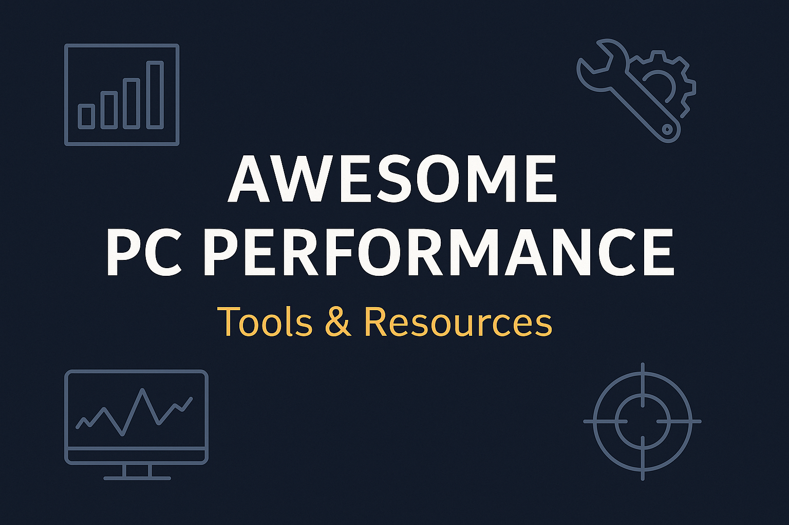

# 🖥️ Awesome PC Performance Tools & Resources

A curated list of tools to analyze, optimize, and monitor PC performance for gaming, productivity, and system stability.  
Whether you're building a new PC, diagnosing a bottleneck, or chasing more FPS — these tools will help you get the most out of your hardware.

---

## 📊 Bottleneck Calculators

- [Bottleneck Calculator](https://bottleneck.tech-latest.com) – Check if your CPU or GPU is limiting system performance. Includes severity level, resolution impact, visual bar charts, and upgrade suggestions.
- [PC Builds Bottleneck Calculator](https://pc-builds.com/calculator/) – Input CPU and GPU to get a quick bottleneck estimation with FPS tips.
- [How Many Bottlenecks?](https://howmanybottlenecks.com/) – Lightweight bottleneck analyzer with a clean UI.

---

## 🧪 Benchmarking Tools

- [UserBenchmark](https://www.userbenchmark.com) – Compare your PC’s performance against thousands of others. Great for quick snapshots.
- [PassMark](https://www.cpubenchmark.net/) – Comprehensive CPU and GPU benchmark rankings from real-world users.
- [3DMark](https://benchmarks.ul.com/3dmark) – Industry-standard GPU benchmark for gamers and professionals.
- [Cinebench](https://www.maxon.net/en/cinebench) – High-precision CPU rendering benchmark. Popular for comparing multi-core performance.
- [CrystalDiskMark](https://crystalmark.info/en/software/crystaldiskmark/) – Benchmark read/write speeds of SSDs and HDDs.

---

## 🧰 Optimization & Monitoring Tools

- [MSI Afterburner](https://www.msi.com/Landing/afterburner) – Real-time GPU monitoring, FPS overlay, overclocking, and fan curves.
- [HWiNFO](https://www.hwinfo.com/) – Advanced hardware monitoring of CPU, GPU, RAM, SSDs, thermals, and more.
- [Process Lasso](https://bitsum.com/) – Control CPU affinity, process priority, and balance foreground/background performance.
- [ThrottleStop](https://www.techpowerup.com/download/techpowerup-throttlestop/) – Voltage/frequency tuning to prevent CPU thermal throttling.
- [LatencyMon](https://resplendence.com/latencymon) – Detects DPC latency issues and background driver lag during real-time audio and gaming.

---

## 🎮 FPS & Game Tuning Tools

- [CapFrameX](https://www.capframex.com/) – Advanced frame time analysis, benchmarking logs, and detailed FPS diagnostics.
- [Razer Cortex](https://www.razer.com/cortex) – Free game booster to auto-optimize RAM usage and background services.
- [NVIDIA GeForce Experience](https://www.nvidia.com/en-us/geforce/geforce-experience/) – Game setting optimizations and driver updates for NVIDIA GPUs.
- [AMD Radeon Software](https://www.amd.com/en/support) – Performance tuning, driver updates, and in-game overlay tools.

---

## 📚 Educational Guides & Articles

- [Optimize Windows 11 for Gaming](https://tech-latest.com/how-to-optimize-windows-11-for-gaming-performance/) - How to Optimize Windows 11 for Gaming Performance using 10+ proven methodos 
- [Is My CPU a Bottleneck?]((https://www.reddit.com/r/pcmasterrace/comments/1901w02/here_is_a_easy_way_to_understand_whether_you_have/)) – How to diagnose CPU limitations in your system and fix them.
- [How Resolution Affects Bottlenecks]((https://linustechtips.com/topic/1107079-will-increasing-resolution-improve-fps-in-case-of-a-cpu-bottleneck/)) – Why higher resolutions reduce CPU bottlenecks and increase GPU load.
- [Fixing FPS Drops: Bottleneck or Bug?]((https://hone.gg/blog/fix-fps-drops/)) – Identify the root cause of inconsistent performance in games.
- [Best Balanced CPU-GPU Combos in 2025](#) – Avoid mismatch. A practical pairing guide for modern PC builders.

---

## 🧠 Coming Soon

- 🔍 Tools to simulate game loads (synthetic)
- 🧰 Thermal throttling analysis tools
- 📦 Community-sourced optimization checklists
- 🎯 Performance presets for different game genres (FPS, RPG, Sim)

---

## 🤝 Contributing

Want to add a new tool, link, or guide? PRs are welcome!  
Please ensure that resources are:
- Actively maintained (or still useful)
- Free or freemium
- Focused on PC performance, gaming, or system optimization

---

## 📜 License

[Creative Commons Zero v1.0 Universal (CC0)](https://creativecommons.org/publicdomain/zero/1.0/)

---

Inspired by [awesome](https://github.com/sindresorhus/awesome).  
Maintained by [@starkSV](https://github.com/starkSV).
